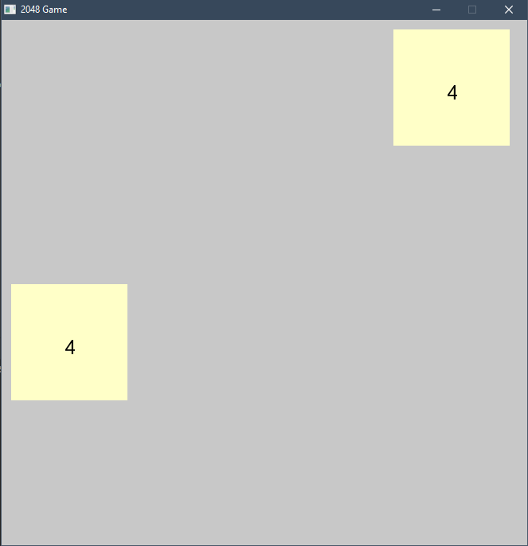
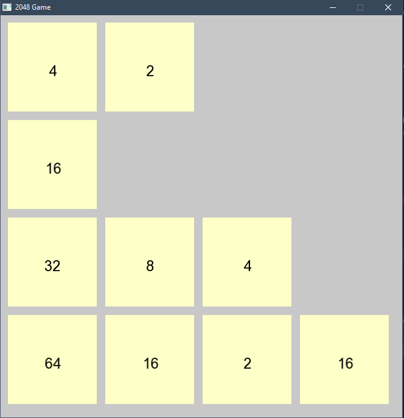

# 2048 SFML
2048 is a popular single-player sliding block puzzle game where the player must combine tiles of the same value to create a tile with the value of 2048. The game is played on a 4x4 grid and the player must move the tiles in all four directions (up, down, left, and right) to combine them.

For this project, we will be creating a 2048 game using the SFML library in C++. The game is currently in development and the following operations will be implemented in the final version:
* Operation 1: Initialize the game board with two tiles randomly placed on the board.
* Operation 2: Move the tiles in all four directions (up, down, left, and right).
* Operation 3: Combine tiles of the same value to create a tile with the value of 2048.
* Operation 4: Check for game over by determining if there are any possible moves left on the board.

## Demo
* Begin
  
  

* Game Play
    
  

## Design
change the repo name:
Can be found in [https://github.com/hanbintan2003/2048-SFML/blob/main/design.txt]

## Features (In Development)

- A user-friendly interface with clear instructions and buttons to restart the game or quit.
- Score tracking to keep track of the player's progress.
